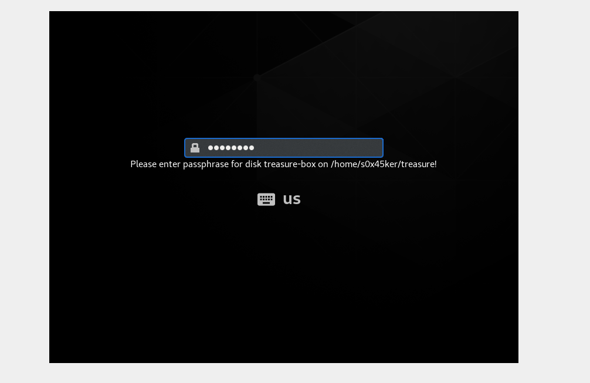
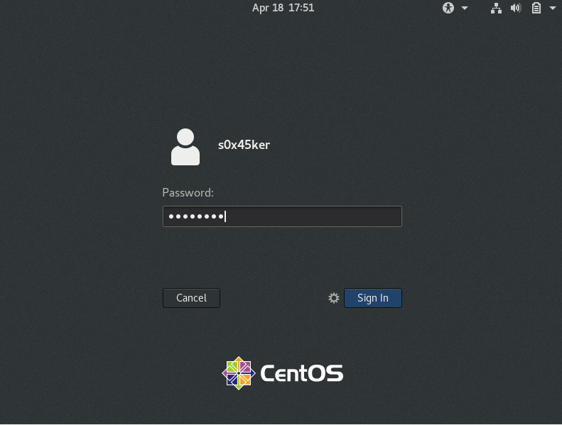
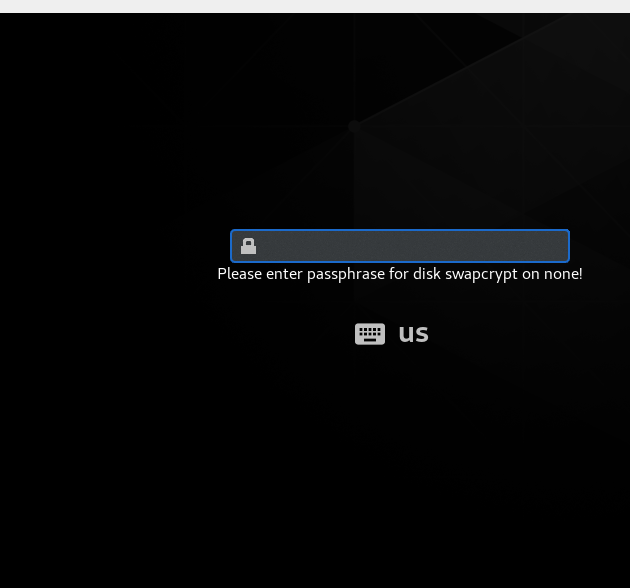

### **Why Use Encryption?**

Encryption should be used wherever sensitive data is being stored and transmitted. Configuring and using block device level encryption provides one of the strongest protections against harm caused by loss or compromise of data contained in hard drives and other media.

Modern Linux distributions offer the choice of encrypting all or some of your disk partitions during installation. It is also straightforward to create and format encrypted partitions at a later time, but you cannot encrypt an already existing partition in place without a data copying operation.

we will be Using cryptsetup with LUKS format to encrypt our disks

### Disk Encryption

ill be making use of /dev/sdb u can use whatever u like, disk or file doesnt matter

```bash
[s0x45ekr--_(+_+)_--Sysadmin ~]$ sudo fdisk /dev/sdb

Welcome to fdisk (util-linux 2.32.1).
Changes will remain in memory only, until you decide to write them.
Be careful before using the write command.

Device does not contain a recognized partition table.
Created a new DOS disklabel with disk identifier 0x3733f8f1.

Command (m for help): g
Created a new GPT disklabel (GUID: 9B1F3DFC-4D80-944A-B31B-C131509954E1).

Command (m for help): p
Disk /dev/sdb: 10 GiB, 10737418240 bytes, 20971520 sectors
Units: sectors of 1 * 512 = 512 bytes
Sector size (logical/physical): 512 bytes / 512 bytes
I/O size (minimum/optimal): 512 bytes / 512 bytes
Disklabel type: gpt
Disk identifier: 9B1F3DFC-4D80-944A-B31B-C131509954E1

Command (m for help): n
Partition number (1-128, default 1): 
First sector (2048-20971486, default 2048): 
Last sector, +sectors or +size{K,M,G,T,P} (2048-20971486, default 20971486): +500M   

Created a new partition 1 of type 'Linux filesystem' and of size 500 MiB.

Command (m for help): p
Disk /dev/sdb: 10 GiB, 10737418240 bytes, 20971520 sectors
Units: sectors of 1 * 512 = 512 bytes
Sector size (logical/physical): 512 bytes / 512 bytes
I/O size (minimum/optimal): 512 bytes / 512 bytes
Disklabel type: gpt
Disk identifier: 9B1F3DFC-4D80-944A-B31B-C131509954E1

Device     Start     End Sectors  Size Type
/dev/sdb1   2048 1026047 1024000  500M Linux filesystem

Command (m for help): w
The partition table has been altered.
Calling ioctl() to re-read partition table.
Syncing disks.

[s0x45ekr--_(+_+)_--Sysadmin ~]$ sudo partprobe -s
/dev/sda: msdos partitions 1 2
/dev/sdb: gpt partitions 1
```

### 1. Encrypt the Disk

```bash
[s0x45ekr--_(+_+)_--Sysadmin ~]$ sudo cryptsetup luksFormat /dev/sdb1
WARNING: Device /dev/sdb1 already contains a 'gpt' partition signature.

WARNING!
========
This will overwrite data on /dev/sdb1 irrevocably.

Are you sure? (Type 'yes' in capital letters): YES
Enter passphrase for /dev/sdb1: 
Verify passphrase:
```

### 2. Create Open Block Device

```bash
[s0x45ekr--_(+_+)_--Sysadmin ~]$ sudo cryptsetup luksOpen /dev/sdb1 treasure-box
Enter passphrase for /dev/sdb1:
```

### 3. Entry within /etc/crypttab

to make available at boot

```bash
[s0x45ekr--_(+_+)_--Sysadmin ~]$ sudo nano /etc/crypttab
GNU nano 2.9.8               /etc/crypttab                         

treasure-box /dev/sdb1
```

place a file system on it

```bash
[s0x45ekr--_(+_+)_--Sysadmin ~]$ sudo mkfs.ext4 /dev/mapper/treasure-box 
mke2fs 1.45.6 (20-Mar-2020)
Creating filesystem with 495616 1k blocks and 123952 inodes
Filesystem UUID: d3784539-d5e9-4f52-86ba-026cef3c19d4
Superblock backups stored on blocks: 
	8193, 24577, 40961, 57345, 73729, 204801, 221185, 401409

Allocating group tables: done                            
Writing inode tables: done                            
Creating journal (8192 blocks): done
Writing superblocks and filesystem accounting information: done
```

### 4. Entry /etc/fstab

```bash
[s0x45ekr--_(+_+)_--Sysadmin ~]$ mkdir treasure
[s0x45ekr--_(+_+)_--Sysadmin ~]$ sudo nano /etc/fstab
/dev/mapper/treasure-box /home/s0x45ker/treasure            ext4    defaults    1 2

```

mount it

```bash
[s0x45ekr--_(+_+)_--Sysadmin ~]$ sudo mount -a
```

reboot 

```bash
[s0x45ekr--_(+_+)_--Sysadmin ~]$ sudo reboot now
```



enter the password



done

### Encrypting Swap

its the same except for few things lets begin

we will make use of swap created from last turtorial follow steps from the tut to recreate

```bash
[s0x45ekr--_(+_+)_--Sysadmin ~]$ cat /proc/swaps
Filename				Type		Size	UsedPriority
/dev/dm-1                               partition	2166780	95744-2
/home/s0x45ker/swapfile                 file		1048572	0	-3
```

### 1. Turn off Swap

```bash
[s0x45ekr--_(+_+)_--Sysadmin ~]$ sudo swapoff swapfile
```

### 2. Encrypt Swap

same steps as disk encryption

—cipher <algo-choice>

```bash
sudo cryptsetup luksFormat --cipher aes swapfile
sudo cryptsetup luksOpen swapfile  swapcrypt

```

### 3. Enable Swap

```bash
[s0x45ekr--_(+_+)_--Sysadmin ~]$ sudo swapon /dev/mapper/swapcrypt
[s0x45ekr--_(+_+)_--Sysadmin ~]$ cat /proc/swaps
Filename				Type		Size	UsedPriority
/dev/dm-1                               partition	2166780	171396	-2
/dev/dm-3                               partition	1032188	0	-3
```




```bash
[s0x45ekr--_(+_+)_--Sysadmin ~]$ cat /proc/swaps
Filename				Type		Size	UsedPriority
/dev/dm-1                               partition	2166780	171396	-2
/dev/dm-3                               partition	1032188	0	-3
```

### Restore default

to go back to normal

```bash
[s0x45ekr--_(+_+)_--Sysadmin ~]$ sudo swapoff /dev/mapper/swapcrypt
[s0x45ekr--_(+_+)_--Sysadmin ~]$ sudo cryptsetup luksClose swapcrypt
[s0x45ekr--_(+_+)_--Sysadmin ~]$ sudo swapon -a

[s0x45ekr--_(+_+)_--Sysadmin ~]$ sudo mkswap swapfile 
mkswap: swapfile: warning: wiping old crypto_LUKS signature.
mkswap: swapfile: warning: wiping old crypto_LUKS signature.
Setting up swapspace version 1, size = 1024 MiB (1073737728 bytes)
no label, UUID=0efcd69c-8350-4547-841b-8e4d36a34f75

[s0x45ekr--_(+_+)_--Sysadmin ~]$ sudo nano /etc/fstab
/home/s0x45ker/swapfile swap                   swap   defaults        0 0s0x45ker

s0x45ekr--_(+_+)_--Sysadmin ~]$ cat /proc/swaps
Filename				Type		Size	Used	Priority
/dev/dm-1                               partition	2166780	174832	-2
/home/s0x45ker/swapfile                 file		1048572	0	-3
```