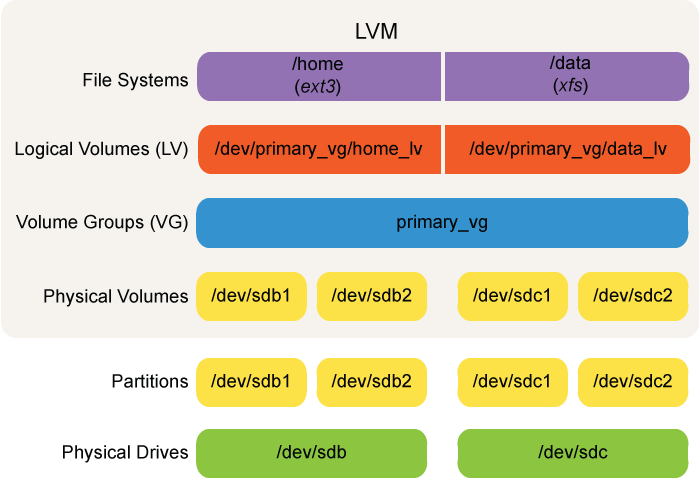

### About Logical Volume Manager

One or more physical volumes (disk partitions) are grouped together into a volume group. Then, the volume group is subdivided into logical volumes, which mimic to the system nominal physical disk partitions and can be formatted to contain mountable filesystems.

Logical volumes are created by putting all the devices into a large pool of disk space (the volume group), and then allocating space from the pool to create a logical volume.

LVM has better scalability than RAID: logical volumes can easily be resized; i.e., enlarged or shrunk, as needs require. If more space is needed, additional devices can be added to the logical volume at any time.




 

### LVM Components

There are a number of command line utilities used to create and manipulate volume groups, whose name always start with **vg**, including:

- **vgcreate**: Creates volume groups.
- **vgextend**: Adds to volume groups.
- **vgreduce**: Shrinks volume groups.

Utilities that manipulate what physical partitions enter or leave volume groups start with **pv** and include:

- **pvcreate**: Converts a partition to a physical volume.
- **pvdisplay**: Shows the physical volumes being used.
- **pvmove**: Moves the data from one physical volume within the volume group to others; this might be required if a disk or partition is being removed for some reason. It would then be followed by:
- **pvremove**: Remove a partition from a physical volume.

Typing **man lvm** will give a full list of LVM utilities.

or

check /sbin/<utility>

/sbin/pv*

```bash
[s0x45ker--_(+_+)_--SysAdmin ~]$ sudo ls -lf /sbin/pv*
/sbin/pvchange	/sbin/pvcreate	 /sbin/pvmove	 /sbin/pvresize  /sbin/pvscan
/sbin/pvck	/sbin/pvdisplay  /sbin/pvremove  /sbin/pvs
```

/sbin/vg*

```bash
[s0x45ker--_(+_+)_--SysAdmin ~]$ sudo ls -lf /sbin/vg*
/sbin/vgcfgbackup   /sbin/vgcreate   /sbin/vgimportclone  /sbin/vgrename
/sbin/vgcfgrestore  /sbin/vgdisplay  /sbin/vgmerge	  /sbin/vgs
/sbin/vgchange	    /sbin/vgexport   /sbin/vgmknodes	  /sbin/vgscan
/sbin/vgck	    /sbin/vgextend   /sbin/vgreduce	  /sbin/vgsplit
/sbin/vgconvert     /sbin/vgimport   /sbin/vgremove
```

/sbin/lv*

```bash
[s0x45ker--_(+_+)_--SysAdmin ~]$ sudo ls -lf /sbin/lv*
/sbin/lvchange	 /sbin/lvm	    /sbin/lvmsadc   /sbin/lvresize
/sbin/lvconvert  /sbin/lvmconfig    /sbin/lvmsar    /sbin/lvs
/sbin/lvcreate	 /sbin/lvmdiskscan  /sbin/lvreduce  /sbin/lvscan
/sbin/lvdisplay  /sbin/lvmdump	    /sbin/lvremove
/sbin/lvextend	 /sbin/lvmpolld     /sbin/lvrename
```

### Create LVM

lets make use of /dev/sdb partitions

```bash
[s0x45ker--_(+_+)_--SysAdmin ~]$ lsblk /dev/sdb
NAME   MAJ:MIN RM  SIZE RO TYPE MOUNTPOINT
sdb      8:16   0    2G  0 disk 
├─sdb1   8:17   0  256M  0 part 
├─sdb2   8:18   0  256M  0 part 
└─sdb3   8:19   0  1.5G  0 part
```

### Create Physical Volumes

lets create pv groups

```bash
[s0x45ker--_(+_+)_--SysAdmin ~]$ sudo pvcreate /dev/sdb1 
WARNING: ext4 signature detected on /dev/sdb1 at offset 1080. Wipe it? [y/n]: y
  Wiping ext4 signature on /dev/sdb1.
  Physical volume "/dev/sdb1" successfully created.
[s0x45ker--_(+_+)_--SysAdmin ~]$ sudo pvcreate /dev/sdb2 
WARNING: ext4 signature detected on /dev/sdb2 at offset 1080. Wipe it? [y/n]: y
  Wiping ext4 signature on /dev/sdb2.
  Physical volume "/dev/sdb2" successfully created.
[s0x45ker--_(+_+)_--SysAdmin ~]$ sudo pvcreate /dev/sdb3
WARNING: ext4 signature detected on /dev/sdb3 at offset 1080. Wipe it? [y/n]: y
  Wiping ext4 signature on /dev/sdb3.
  Physical volume "/dev/sdb3" successfully created.
```

### Display PV

lets display them

```bash
[s0x45ker--_(+_+)_--SysAdmin ~]$ sudo pvdisplay
  --- Physical volume ---
  PV Name               /dev/sda2
  VG Name               cl
  PV Size               <20.32 GiB / not usable 0   
  Allocatable           yes (but full)
  PE Size               4.00 MiB
  Total PE              5201
  Free PE               0
  Allocated PE          5201
  PV UUID               HkaGdc-0SM4-q58B-GLpF-yBKh-dluM-Zb7psU
   
  "/dev/sdb1" is a new physical volume of "256.00 MiB"
  --- NEW Physical volume ---
  PV Name               /dev/sdb1
  VG Name               
  PV Size               256.00 MiB
  Allocatable           NO
  PE Size               0   
  Total PE              0
  Free PE               0
  Allocated PE          0
  PV UUID               r4DxPp-DwXw-MTKV-0rgJ-wslR-WvXf-ddTp95
   
  "/dev/sdb2" is a new physical volume of "256.00 MiB"
  --- NEW Physical volume ---
  PV Name               /dev/sdb2
  VG Name               
  PV Size               256.00 MiB
  Allocatable           NO
  PE Size               0   
  Total PE              0
  Free PE               0
  Allocated PE          0
  PV UUID               p1MmuS-FtMY-TSfc-QTs0-f5kQ-8H02-G2hAkM
   
  "/dev/sdb3" is a new physical volume of "<1.50 GiB"
  --- NEW Physical volume ---
  PV Name               /dev/sdb3
  VG Name               
  PV Size               <1.50 GiB
  Allocatable           NO
  PE Size               0   
  Total PE              0
  Free PE               0
  Allocated PE          0
  PV UUID               Sg0adM-I34I-WdtH-FSBh-fv4E-6v0q-MfwpBh
```

### Create Volume Groups

lets create vg groups

```bash
[s0x45ker--_(+_+)_--SysAdmin ~]$ sudo vgcreate myvgName /dev/sdb1 /dev/sdb2
  Volume group "myvgName" successfully created
```

### Display Volume Groups

```bash
[s0x45ker--_(+_+)_--SysAdmin ~]$ sudo vgdisplay 
  --- Volume group ---
  VG Name               myvgName
  System ID             
  Format                lvm2
  Metadata Areas        2
  Metadata Sequence No  2
  VG Access             read/write
  VG Status             resizable
  MAX LV                0
  Cur LV                1
  Open LV               0
  Max PV                0
  Cur PV                2
  Act PV                2
  VG Size               504.00 MiB
  PE Size               4.00 MiB
  Total PE              126
  Alloc PE / Size       125 / 500.00 MiB
  Free  PE / Size       1 / 4.00 MiB
  VG UUID               22zcce-qKWO-LsZ4-NsIK-2LaG-BihC-PXpOu3
   
  --- Volume group ---
  VG Name               cl
  System ID             
  Format                lvm2
  Metadata Areas        1
  Metadata Sequence No  3
  VG Access             read/write
  VG Status             resizable
  MAX LV                0
  Cur LV                2
  Open LV               2
  Max PV                0
  Cur PV                1
  Act PV                1
  VG Size               <20.32 GiB
  PE Size               4.00 MiB
  Total PE              5201
  Alloc PE / Size       5201 / <20.32 GiB
  Free  PE / Size       0 / 0   
  VG UUID               KE3I02-N1rq-Jt6O-EfGT-jFFc-thKG-Bu7w0V
```

### Create Logical Volumes

```bash
[s0x45ker--_(+_+)_--SysAdmin ~]$ sudo lvcreate -L 500M -n mylvmName myvgName
  Logical volume "mylvmName" created.
```

### Display Logical Volumes

```bash
[s0x45ker--_(+_+)_--SysAdmin ~]$ sudo lvdisplay
  --- Logical volume ---
  LV Path                /dev/myvgName/mylvmName
  LV Name                mylvmName
  VG Name                myvgName
  LV UUID                O3Tq2d-Ncn6-Ek56-ZJv5-l6pg-Cf25-4dcc4D
  LV Write Access        read/write
  LV Creation host, time localhost.localdomain, 2021-04-17 12:50:40 +0530
  LV Status              available
  # open                 0
  LV Size                500.00 MiB
  Current LE             125
  Segments               2
  Allocation             inherit
  Read ahead sectors     auto
  - currently set to     8192
  Block device           253:2
   
  --- Logical volume ---
  LV Path                /dev/cl/swap
  LV Name                swap
  VG Name                cl
  LV UUID                U40evz-UBNH-NuhE-6vn9-yW96-cC2B-1xgZgW
  LV Write Access        read/write
  LV Creation host, time localhost, 2020-11-12 19:37:26 +0530
  LV Status              available
  # open                 2
  LV Size                <2.07 GiB
  Current LE             529
  Segments               1
  Allocation             inherit
  Read ahead sectors     auto
  - currently set to     8192
  Block device           253:1
   
  --- Logical volume ---
  LV Path                /dev/cl/root
  LV Name                root
  VG Name                cl
  LV UUID                pfO1zZ-tB1E-a0p1-SCa9-68nu-jwMc-vK316T
  LV Write Access        read/write
  LV Creation host, time localhost, 2020-11-12 19:37:26 +0530
  LV Status              available
  # open                 1
  LV Size                18.25 GiB
  Current LE             4672
  Segments               1
  Allocation             inherit
  Read ahead sectors     auto
  - currently set to     8192
  Block device           253:0
```

### Put A Filesystem on LVM

using mkfs

```bash
[s0x45ker--_(+_+)_--SysAdmin ~]$ sudo mkfs.ext4 /dev/myvgName/mylvmName
mke2fs 1.45.6 (20-Mar-2020)
Creating filesystem with 512000 1k blocks and 128016 inodes
Filesystem UUID: b8106acd-3151-408b-9c73-e2d1fdf8191e
Superblock backups stored on blocks: 
	8193, 24577, 40961, 57345, 73729, 204801, 221185, 401409

Allocating group tables: done                            
Writing inode tables: done                            
Creating journal (8192 blocks): done
Writing superblocks and filesystem accounting information: done
```

### Create Dir for Mount

```bash
[s0x45ker--_(+_+)_--SysAdmin ~]$ sudo mkdir /mylvmpnt
```

### Mount Filesystem

```bash
[s0x45ker--_(+_+)_--SysAdmin ~]$ sudo mount /dev/myvgName/mylvmName /mylvmpnt
```

### Check Filesystem mount

```bash
[s0x45ker--_(+_+)_--SysAdmin ~]$ df -Th | grep lvm
/dev/mapper/myvgName-mylvmName ext4      477M  2.3M  445M   1% /mylvmpnt
```

### Make persistent Mount

using fstab

`[s0x45ker--*(+*+)_--SysAdmin ~]$ sudo nano /etc/fstab`

```bash
#
# /etc/fstab
# Created by anaconda on Thu Nov 12 19:37:28 2020
#
# Accessible filesystems, by reference, are maintained under '/dev/disk/'.
# See man pages fstab(5), findfs(8), mount(8) and/or blkid(8) for more info.
#
# After editing this file, run 'systemctl daemon-reload' to update systemd
# units generated from this file.
#
/dev/mapper/cl-root     /                       xfs     defaults        0 0
UUID=03f520f5-2aec-411c-a15b-3e2f62ffc37c /boot ext4    defaults        1 2
/dev/mapper/cl-swap     swap                    swap    defaults        0 0

/dev/myvgName/mylvmName	/mylvmpnt               ext4    defaults        0 0
```

### Extent LVM

using lvresize

```bash
[s0x45ker--_(+_+)_--SysAdmin ~]$ sudo lvresize -r -L +200M /dev/myvgName/mylvmName
  Insufficient free space: 50 extents needed, but only 1 available
```

### Extend Volume Group

lets resize Volume Group

```bash
[s0x45ker--_(+_+)_--SysAdmin ~]$ sudo vgextend myvgName /dev/sdb3
  Volume group "myvgName" successfully extended
```

display extended vg

```bash
[s0x45ker--_(+_+)_--SysAdmin ~]$ sudo vgdisplay myvgName
  --- Volume group ---
  VG Name               myvgName
  System ID             
  Format                lvm2
  Metadata Areas        3
  Metadata Sequence No  3
  VG Access             read/write
  VG Status             resizable
  MAX LV                0
  Cur LV                1
  Open LV               1
  Max PV                0
  Cur PV                3
  Act PV                3
  VG Size               <1.99 GiB
  PE Size               4.00 MiB
  Total PE              509
  Alloc PE / Size       125 / 500.00 MiB
  Free  PE / Size       384 / 1.50 GiB
  VG UUID               22zcce-qKWO-LsZ4-NsIK-2LaG-BihC-PXpOu3
```

### Finally lets our LVM

```bash
[s0x45ker--_(+_+)_--SysAdmin ~]$ sudo lvresize -r -L +200M /dev/myvgName/mylvmName
  Size of logical volume myvgName/mylvmName changed from 500.00 MiB (125 extents) to 700.00 MiB (175 extents).
  Logical volume myvgName/mylvmName successfully resized.
resize2fs 1.45.6 (20-Mar-2020)
Filesystem at /dev/mapper/myvgName-mylvmName is mounted on /mylvmpnt; on-line resizing required
old_desc_blocks = 4, new_desc_blocks = 6
The filesystem on /dev/mapper/myvgName-mylvmName is now 716800 (1k) blocks long.
```

### Create LVM Snapshot

LVM snapshots create an exact copy of an existing logical volume. They are useful for backups, application testing, and deploying VMs (Virtual Machines). The original state of the snapshot is kept as the block map.

Snapshots only use space for storing deltas:

- When the original logical volume changes, original data blocks are copied to the snapshot.
- If data is added to snapshot, it is stored only there.

```bash
[s0x45ker--_(+_+)_--SysAdmin ~]$ sudo lvcreate -l 128 -s -n mysnap /dev/myvgName/mylvmName
  Logical volume "mysnap" created.
```

check snap

```bash
[s0x45ker--_(+_+)_--SysAdmin ~]$ df -Th | grep mysnap
/dev/mapper/myvgName-mysnap    ext4      670M  2.5M  631M   1% /mnt
```

### Delete Snapshot or Any LVM

```bash
[s0x45ker--_(+_+)_--SysAdmin ~]$  sudo lvremove /dev/myvgName/mysnap
Do you really want to remove active logical volume myvgName/mysnap? [y/n]: y
  Logical volume "mysnap" successfully removed
```