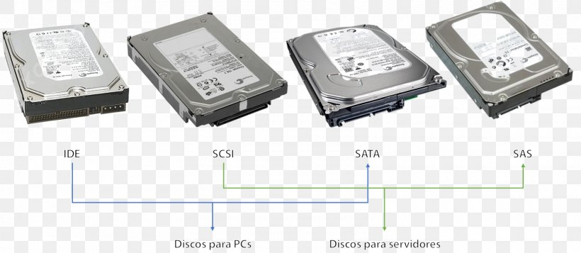
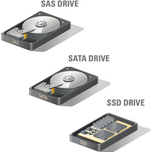

### SATA (Serial Advanced Technology Attachment)

SATA disks were designed to replace the old IDE drives. They offer a smaller cable size (7 pins), native hot swapping, and faster and more efficient data transfer. They are seen as SCSI devices.

### SCSI (Small Computer Systems Interface)

SCSI disks range from narrow (8 bit bus) to wide (16 bit bus), with a transfer rate between 5 MB per second (narrow, standard SCSI) and 160 MB per second (Ultra-Wide SCSI-3). Most PCs use single-ended or differential SCSI drives. Unfortunately, the two types are not compatible with each other. Fortunately, the two types of devices may coexist on the same controller. Single-ended devices may host up to 7 devices, and use a maximum cable length of about 6 meters. Differential controllers may host up to 15 devices and have a maximum cable length of about 12 meters.

### SAS (Serial Attached SCSI)

They use a newer point-to-point protocol, and have a better performance than SATA disks.

### USB (Universal Serial Bus)

These include flash drives and floppies. And are seen as SCSI devices.

### SSD (Solid State Drives)

Modern SSD drives have come down in price, have no moving parts, use less power than drives with rotational media, and have faster transfer speeds. Internal SSDs are even installed with the same form factor and in the same enclosures as conventional drives. SSDs still cost a bit more, but price is decreasing. It is common to have both SSDs and rotational drives in the same machines, with frequently accessed and performance critical data transfers taking place on the SSDs.

### lIDE and EIDE (Integrated Drive Electronics, Enhanced IDE)

These are obsolete.

