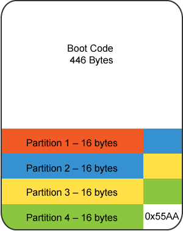
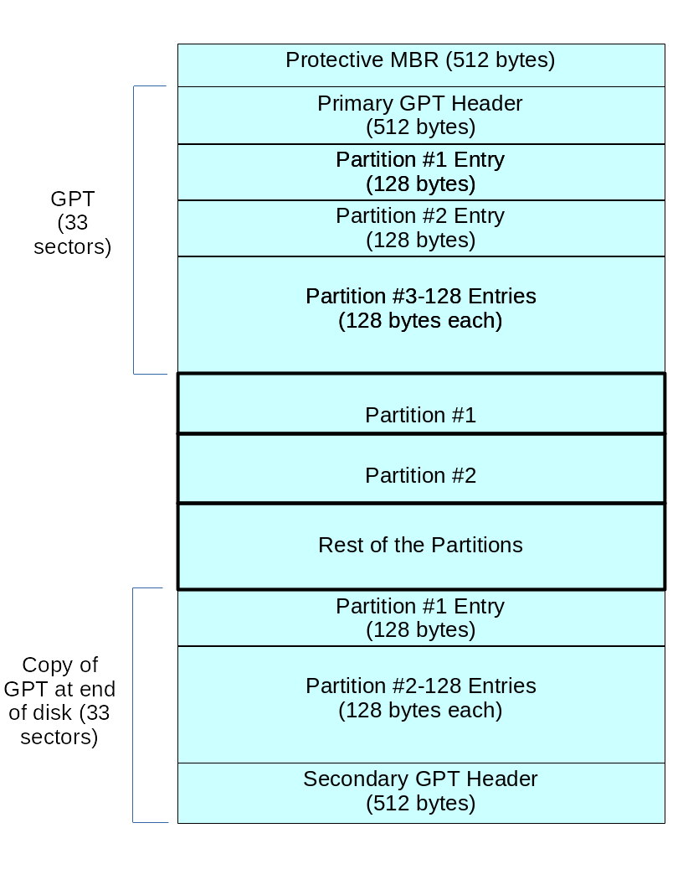

### Disks

Disks are divided into partitions. In geometrical terms, these consist of physically contiguous groups of sectors or cylinders. A partition is a physically contiguous region on the disk. There are two partitioning layouts in use:

- MBR (Master Boot Record)
- GPT (GUID Partition Table).

MBR dates back to the early days of MSDOS.

The disk partition table is contained within the disk's Master Boot Record (MBR), and is the 64 bytes following the 446 byte boot record. One partition on a disk may be marked active. When the system boots, that partition is where the MBR looks for items to load.

Remember that there can be only one extended partition, but that partition may contain a number of logical partitions.

The structure of the MBR is defined by an operating system-independent convention. The first 446 bytes are reserved for the program code. They typically hold part of a boot loader program. The next 64 bytes provide space for a partition table of up to four entries. The operating system needs this table for handling the hard disk.

On Linux systems, the beginning and ending address in CHS is ignored.

Note for the curious, there are 2 more bytes at the end of the MBR known as the magic number, signature word, or end of sector marker, which always have the value 0x55AA.

### MBR Disk Partition Table

Each entry in the partition table is 16 bytes long, and describes one of the four possible primary partitions. The information for each is:

- Active bit
- Beginning address in cylinder/head/sectors (CHS) format (ignored by Linux)
- Partition type code, indicating: xfs, LVM, ntfs, ext4, swap, etc.
- Ending address in CHS (also ignored by Linux)
- Start sector, counting linearly from 0
- Number of sectors in partition.

Linux only uses the last two fields for addressing, using the linear block addressing (LBA) method.

### GPT Partition Table

GPT is on all modern systems and is based on UEFI (Unified Extensible Firmware Interface). By default, it may have up to 128 primary partitions. When using the GPT scheme, there is no need for extended partitions. Partitions can be up to 233 TB in size (with MBR, the limit is just 2TB).

Modern hardware comes with GPT support; MBR support will gradually fade away.

The Protective MBR is for backwards compatibility, so UEFI systems can be booted the old way.

There are two copies of the GPT header, at the beginning and at the end of the disk, describing metadata:

- List of usable blocks on disk
- Number of partitions
- Size of partition entries. Each partition entry has a minimum size of 128 bytes.

Patrition Table editiors

- **fdisk**

    **fdisk** is a menu-driven partition table editor. It is the most standard and one of the most flexible of the partition table editors. As with any other partition table editor, make sure that you either write down the current partition table settings or make a copy of the current settings before making changes.

- **sfdisk**

    **sfdisk** is a non-interactive Linux-based partition editor program, making it useful for scripting. Use the **sfdisk** tool with care!

- **parted**

    **parted** is the GNU partition manipulation program. It can create, remove, resize, and move partitions (including certain filesystems). The GUI interface to the **parted** command is **gparted**.

- **gparted**

    **gparted** is a widely-used graphical interface to **parted**.

- **gdisk**

    **gdisk** is used for GPT systems, but can also operate on MBR systems.

- **sgdisk**

    sgdisk is a script or command line interface.