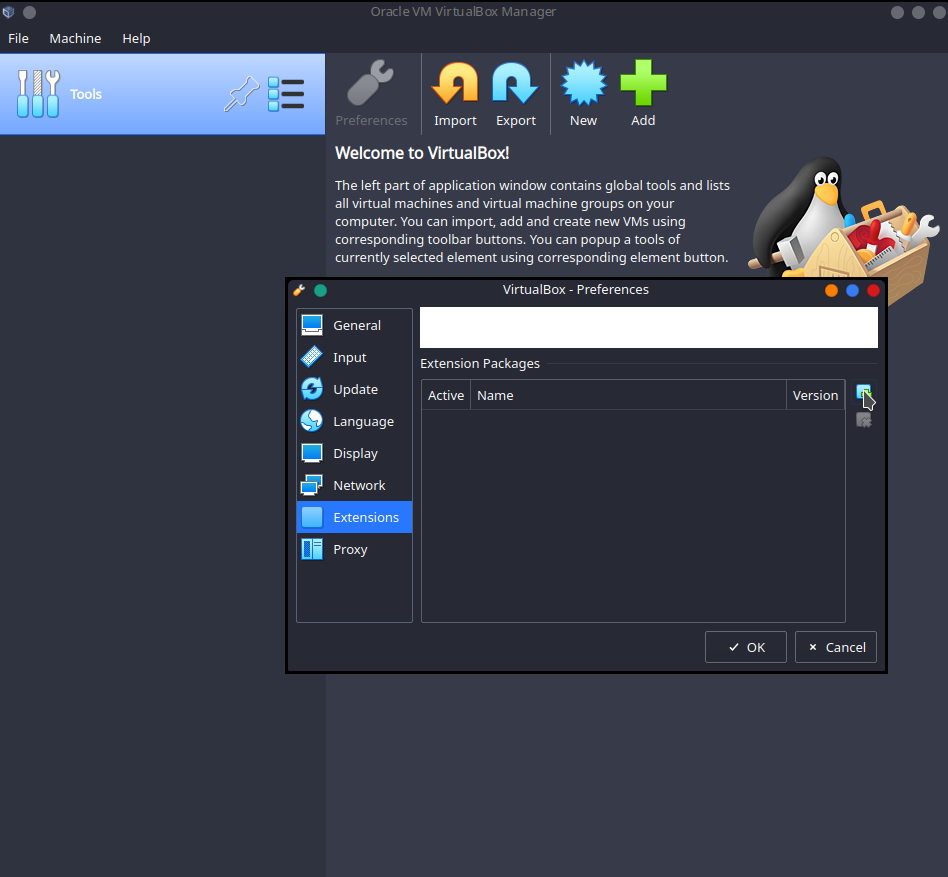
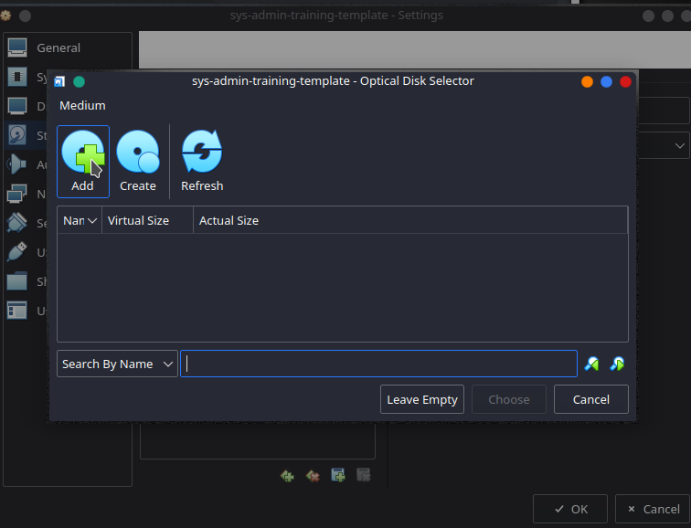
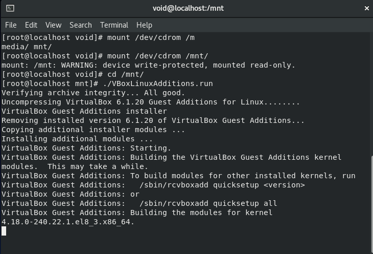

This Post we will focus on building our lab to practice Sys-Admin Tasks.

There are multiple ways of setting up the lab with different distro's.
 
* Cloud (AWS,GCP etc) Free tier.
* Hypervisor (virtual box, Vmware etc)
* Vagrant (which would use an hypervisor but convenient for ready to use boxs)

many more.


 I will choose Hypervisor(Virtual Box) with my host OS as Kubuntu.

 ### Download VirtualBox

<a id="virtualbox" href="https://www.virtualbox.org/wiki/Downloads" target="_blank">virtualbox-link</a> 


select the distribution of your choice and download it. 


### Install VirtualBox

installation instructions are provided within the docs.

in my case 


### Download Extension Pack

Download the extension from the <a href=#virtualbox>`virtualbox-link`</a>


## Install Extension Pack

lets install the extension pack 

* click on `File` on top left corner

* `Prefrences`

* `Extensions`

 

 

* it will ask u to `install` do it

* scroll and `agree` the license

* click `OK`

we have successfully install extension pack


### Download Centos Image

<a id="centos" href="https://www.centos.org/download/" target="_blank">centos-download</a> 

select the architecture dependent dvd.iso file


### Install centos 8

* click on add `New`


* Name and Operating System

    - Type Name : `desired name`

    - Machine Folder: `desired location`
    
    - Type: `Linux` 

    - Version : `Red Hat (64-bit)`


* Memory Size

    around `1024MB`


* Create virtual hardisk
   - click on `create`


* Hardisk file type
    - `VDI (VirtualBox Disk Image)`


* Storage on physical hard disk
    - `Dynamically allocated`


* File location and size
    - leave location as is
    - size : `20 GB`


You should get something like this


Change the name by clicking on `Settings` icon at the top center Navbar


* and click `OK`

we will be using this as `base template` for creating `multiple instances` in case our vm breaks or all Hell falls upon us we can always create new one from base template.

`PS:` we could have set the name at the very start but forgot it hence i changed it later

u can also create `snapshots` to save workstate

### Configure Base Template

- click on settings
    - General
        - advanced
            - clipboard & Drag'n'Drop : `Bidirectional`


* Boot Order


* Add DVD Installer





- Click on `Start`


- Click on install centos 8


It might take some time be patient


click continue


click done


on it and click done


click done twice if pass simple


click done twice


Be patient this might take some time

Restart the box


tick mark and click done


* Login with credentials

### Install Guest Editions 

open terminal

and follow these steps

`su`

login as root

```
dnf install -y epel-release
```
<br>


* Install Kernel Headers and Build Tools

```
sudo dnf install -y gcc make perl kernel-devel kernel-headers bzip2 dkms
```


```
rpm -q kernel-devel
uname -r
```

might face kernel conflict like i do 


To resolve this issue 

```
dnf update kernel-*
```

type `y` on prompt


reboot

```
reboot now
```

select the correct kernel during boot


again check kernel info

```
rpm -q kernel-devel
uname -r
```


```
mount /dev/cdrom /mnt   

./VBoxLinuxAdditions.run
```
<br> 



```
shudown now
```

### Clone The Base Template

* right click on the box select `clone`
    - Full clone


### Start Clone


