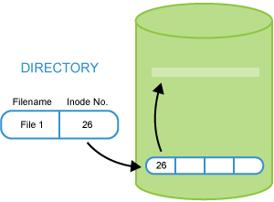

Application programs read and write files , rather than dealing with physical locations on the actual hardware on which files are stored. Filesystems create a usable format on physical partition.

Files and their names are an abstraction camouflaging the physical I/O layer.

A UNIX-like filesystem uses a tree hierarchy:

- Directories contain files and/or other directories
- Every path or node is under the root directory.

Multiple filesystems may be (and usually are) merged together into a single tree structure. Linux uses a virtual filesystem layer (VFS) to communicate with the filesystem software.

Local filesystems generally reside within a disk partition which can be a physical partition on a disk, or a logical partition controlled by a Logical Volume Manager (LVM). Filesystems can also be of a network nature and their true physical embodiment completely hidden to the local system across the network.

### **Inodes**

An inode is a data structure on disk that describes and stores file attributes, including location. Every file is associated with its own inode. The information stored in the inode includes:

- Permissions
- User and group ownership
- Size
- Timestamps (nanosecond)Last access timeLast modification timeChange time.

**Data storage in an inode vs data storage in a directory file**

# 💡

File names are not stored in a file's inode, but are instead stored in the directory file. The name of a file is just a property of its inode, which is the more fundamental object.

All I/O activity concerning a file usually also involves the file's inode, as information must be updated.

### Journaling Filesystems

Journaling filesystems recover from system crashes or ungraceful shutdowns with little or no corruption, and do so very rapidly. While this comes at the price of having some more operations to do, additional enhancements can more than offset the price.

In a journaling filesystem, operations are grouped into transactions. A transaction must be completed without error, atomically; otherwise, the filesystem is not changed. A log file is maintained of transactions. When an error occurs, usually only the last transaction needs to be examined.

Linux supports many filesystem varieties, most with full read and write access, including:

- ext4: Linux native filesystem (and earlier ext2 and ext3)
- XFS: A high-performance filesystem originally created by SGI
- JFS: A high-performance filesystem originally created by IBM
- Windows-natives: FAT12, FAT16, FAT32, VFAT, NTFS
- Pseudo-filesystems resident only in memory, including proc, sysfs, devfs, debugfs
- Network filesystems such as NFS, coda, afs
- etc.

This democratic flexibility has been a large factor in its success. Most filesystems have full read/write access, while a few have read only access.

Commonly used filesystems include ext4, xfs, btrfs, squashfs, nfs and vfat. A list of currently supported filesystems is at **/proc/filesystems**.

### Special Filesystems

Linux widely employs the use of special filesystems for certain tasks. These are particularly useful for accessing various kernel data structures and tuning kernel behavior, or for implementing particular functions. Note that some of these special filesystems have no mount point, such as **sockfs** or **pipefs**; this means user applications don't interact with them, but the kernel uses them, taking advantage of VFS layers and code. These special filesystems are really not true filesystems; they are kernel facilities or subsystems that find the filesystem structural abstraction to be a useful way to recognize data and functionality.

**Table: Special Filesystems**

 FILESYSTEM  | MOUNT POINT       | PURPOSE                                                           
 ----------  | ----------------- | ----------------------------------------------------------------                 
 rootfs	     | None	             | During kernel load, provides an empty root directory              
 hugetlbfs   | Anywhere	         | Provides extended page access (2 or 4 MB on X86)                  
 bdev	     | None	             | Used for block devices                                            
 proc	     | /proc	         | Pseudofilesystem access to many kernel structures and subsystems  
 sockfs	     | None	             | Used by BSD Sockets                                               
 tmpfs	     | Anywhere          | RAM disk with swapping, re-sizing                                 
 shm	     | None	             | Used by System V IPC Shared Memory                                
 pipefs	     | None	             | Used for pipes                                                       
 binfmt_misc | Anywhere	         | Used by various executable formats                                
 devpts	     | /dev/pts	         | Used by Unix98 pseudo-terminals                                   
 usbfs	     | /proc/bus/usb	 | Used by USB sub-system for dynamical devices                      
 sysfs	     | /sys	             | Used as a device tree                                             
 debugfs	 | /sys/kernel/debug | Used for simple debugging file access                             

