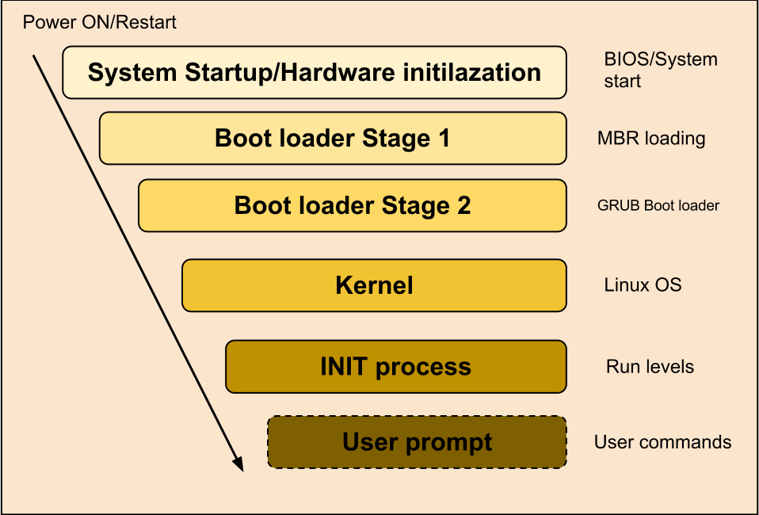

In this post we will take about the boot process of linux OS

### Stages

There are 4 Stages and they are:

1.  The Firmware Phase (BIOS and UEFI integrity check) (POST)

2.  The Bootloader Phase

3.  The Kernel Phase (initialization)

4.  Starting Systemd, the parent of all processes

### Firmware Phase

The firmware is the BIOS (Basic Input/Output System) or the UEFI (Unified Extensible Firmware Interface) code that is stored in flash memory on the mother board. 

It runs Power-On-Self-Test (POST) to detect, test, and initialize system hardware components (HDD or SSD, Keyboard, RAM, USB ports etc) later it locates for a boot device that contains the bootloader program .

As soon as it finds as it discovers usable boot device, it loads the bootloader into memory and passes control over to it.

### The Bootloader Phase

This is located at the boot sector of the boot device. Most linux systems use GRUB2 (Grand Unified Bootloader) version 2 supports both BIOS and UEFI firmware /boot/grub if version 1 or /boot/grub2/grub.cfg file for configuration . 

UEFI- based systems look for /boot/efi file instead

Bootloader releases control over to the kernel.

### Kernel Phase

The Kernel is the central program of the operating system, providing access to hardware and system services. 

kernel extracts the initial RAM disk (initrd) found at the /boot puts it into memory, decompresses it, mounts it as read-only temporary filesystem then loads neccessary modules, drivers required for hardware and physical disks and partitions 

Later unmounts the initrd image and mounts the actual physical root file system on / as read/write mode.

Finally the kernel executes the *systemd* process with PID 1 and passes the control over to it.

### Systemd Phase

systemd takes control from the kernel and continues the boot process.

actually before the systemd adoption there was systemvinit which looked at the init runlevel, ... backward compatibility is yet there while systemd looks for targets 
and handles services via systemctl using those targets.

Here’s a breakdown of the systemd targets:

- **poweroff.target (runlevel 0):** `Poweroff or Shutdown the system.`
- **rescue.target (runlevel 1):** `launches a rescue shell session.`
- **multi-user.target (runlevel 2,3,4):** `Configures the system to a non-graphical (console) multi-user system.`
- **graphical.target (runlevel 5)**: `Set the system to use a graphical multi-user interface with network services.`
- **reboot.target (runlevel 6):** `reboots the system.`

To check the current target on your system, run the command:

```
[s0x45ker--_(+_+)_--SysAdmin ~]$ systemctl get-default
```
<br>
You can switch from one target to another by running the following command on the terminal:

```
[s0x45ker--_(+_+)_--SysAdmin ~]$ init runlevel-value
```
<br>
The booting process ends once systemd loads all the daemons and sets the target or run level value. It’s at this point you are prompted for your username and password upon which you gain entry to your Linux system.


