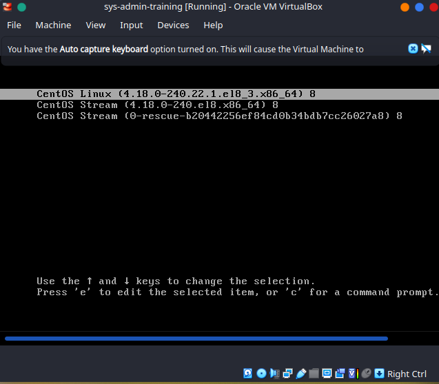
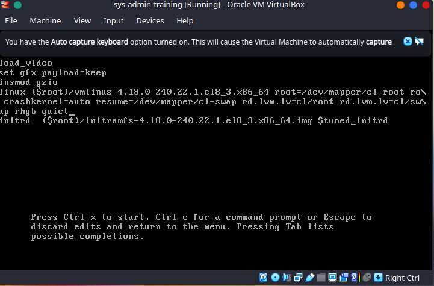
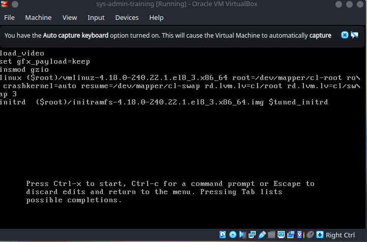
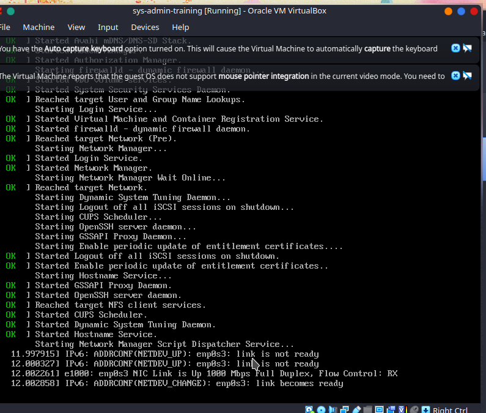
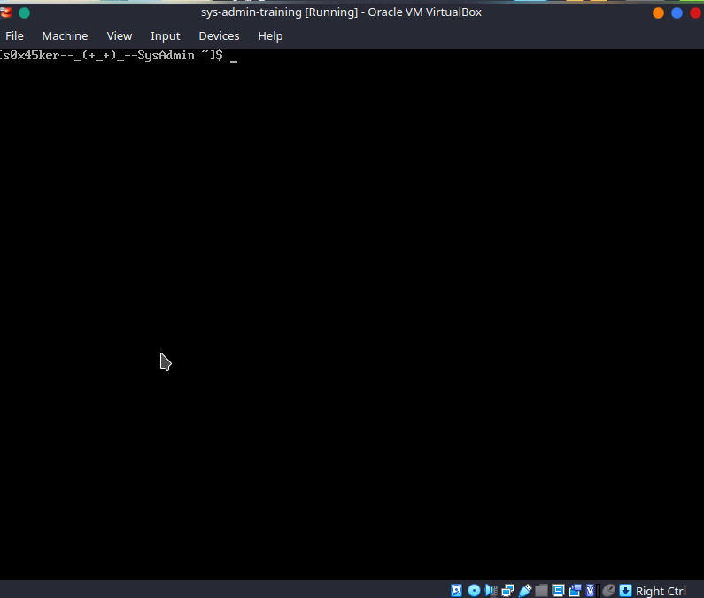
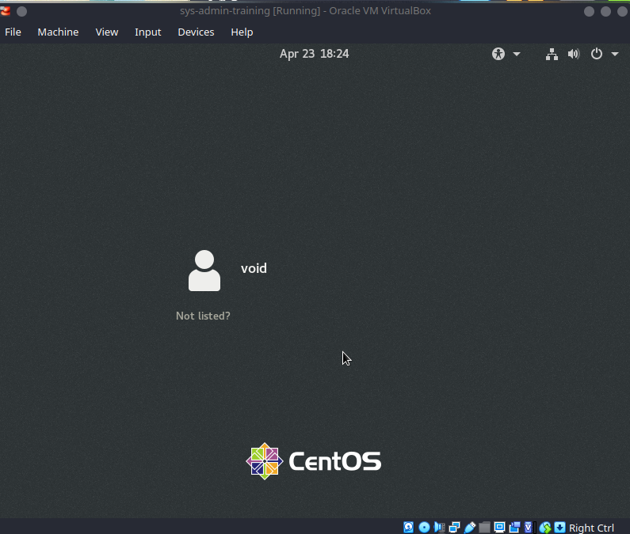

### About
Virtually, all x86-based Linux systems (outside the embedded sphere) today use GRUB (GRand Unified Bootloader) to handle the early phases of system startup. Other platforms may have other equivalents, such as ELILO used on EFI systems such as IA64 (Itanium), and Das U-BOOT used on many embedded configurations.

Some important features of GRUB are:
- Alternative operating systems can be chosen at boot time.
- Alternative kernels and/or initial ramdisks can be chosen at boot time for a given operating system.
- Boot parameters can be easily changed at boot time without having to edit configuration files, etc., in advance.

Version 2 has replaced Version 1 on all major Linux distributions except for a few

### Versions

While details are different between GRUB 2 and the legacy Version 1, they are fundamentally the same.

At boot, a basic configuration file is read, /boot/grub/grub.cfg, or /boot/grub2/grub.cfg, or /boot/efi/EFI/redhat/grub.cfg.

This file is auto-generated by update-grub (or grub2-mkconfig) based on configuration files in the /etc/grub.d directory and on /etc/default/grub and should not be edited by hand. Usually, these utilities are run from other distribution-supplied scripts used for updating or compiling Linux kernels.


### Selection, Edit Grub During Boot

After the Post and BIOS stages the grub menu is displayed 



Using up and down arrows and the Enter key, you can select the right boot option, or can wait for a configurable time period before the default choice is entered.

However, you can do much more. After selecting an entry, you can type e for edit and then enter into an interactive shell. In this shell, you can alter the stanza in the configuration file that describes that particular boot option. 

 If there are serious problems, like not being able to find a configuration file, GRUB reverts back to this command line mode and you may be able to rescue the system without resorting to rescue media.

### Installing Grub

if you do not install GRUB during system installation, or you need to re-install at some later point, the exact procedure for doing so depends on the GRUB version. 

For Version 2, the installation procedure can be as easy as:

```
[s0x45ker--_(+_+)_--SysAdmin ~]$ sudo grub2-install /dev/sda
```

Please read the man page carefully before running such a command; there are many options, and messing up GRUB can make your system un-bootable. 

Note on EFI multi-boot systems, you may have to also run efibootmgr as things can be more complex. See the man page for more details.

In my case i had partitioned my SSD into partitons one was EFI(boot) and other was LVM(lvmroot, lvmswap, lvmhome).

### GRUB Configuration Files

etc/default/grub
```shell
[s0x45ker--_(+_+)_--SysAdmin ~]$ cat /etc/default/grub 
GRUB_TIMEOUT=5
GRUB_DISTRIBUTOR="$(sed 's, release .*$,,g' /etc/system-release)"
GRUB_DEFAULT=saved
GRUB_DISABLE_SUBMENU=true
GRUB_TERMINAL_OUTPUT="console"
GRUB_CMDLINE_LINUX="crashkernel=auto resume=/dev/mapper/cl-swap rd.lvm.lv=cl/root rd.lvm.lv=cl/swap rhgb quiet"
GRUB_DISABLE_RECOVERY="true"
GRUB_ENABLE_BLSCFG=true
[s0x45ker--_(+_+)_--SysAdmin ~]$ 
```

etc/grub.d

```shell
[s0x45ker--_(+_+)_--SysAdmin ~]$ sudo ls -l /etc/grub.d
total 92
-rwxr-xr-x. 1 root root  8958 Sep  9  2020 00_header
-rwxr-xr-x. 1 root root  1043 Jun 15  2020 00_tuned
-rwxr-xr-x. 1 root root   232 Sep  9  2020 01_users
-rwxr-xr-x. 1 root root   832 Sep  9  2020 08_fallback_counting
-rwxr-xr-x. 1 root root 14088 Sep  9  2020 10_linux
-rwxr-xr-x. 1 root root   830 Sep  9  2020 10_reset_boot_success
-rwxr-xr-x. 1 root root   889 Sep  9  2020 12_menu_auto_hide
-rwxr-xr-x. 1 root root 11696 Sep  9  2020 20_linux_xen
-rwxr-xr-x. 1 root root  2559 Sep  9  2020 20_ppc_terminfo
-rwxr-xr-x. 1 root root 10670 Sep  9  2020 30_os-prober
-rwxr-xr-x. 1 root root  1412 Sep  9  2020 30_uefi-firmware
-rwxr-xr-x. 1 root root   214 Sep  9  2020 40_custom
-rwxr-xr-x. 1 root root   216 Sep  9  2020 41_custom
-rw-r--r--. 1 root root   483 Sep  9  2020 README
[s0x45ker--_(+_+)_--SysAdmin ~]$ 
```
It is possible to switch to the new scheme by running the grub2-switch-to-blscfg program. One can also turn the new method on and off by altering the the variable GRUB_ENABLE_BLSCFGS=[true|false].

Each of the two files (/etc/default/grub and /etc/grub.d) runs in ascending order when the configuration file is updated. 

New file can be generated by grub2-mkconfig or grub-mkconfig.

### lets take an example of using the GRUB:

press 'e' while in grub before it enters default boot u should see something like this



we will edit the line begining with linux press 'end' button after moving to the begining of the line using arrow keys

remove 'quiet'(system boot messages) 'rgb(GUI)'

add 3 or text like this



press Ctrl-x to start

boot messages will be displayed



and eventually u will enter sage mode



to get back GUI

$ sudo systemctl start gdm

$ sudo systemctl start lightdm

$ sudo telinit 5

$ sudo service gdm restart

$ sudo service lightdm restart

```shell
[s0x45ker--_(+_+)_--SysAdmin ~]$ sudo systemctl start gdm
```

will start the GUI login page


