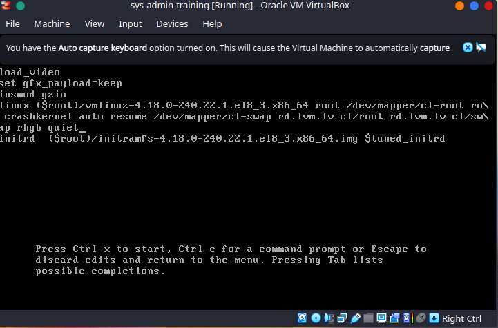

### About

Linux is only the kernel of the operating system, which includes many other components, such as libraries and applications that interact with the kernel.

The kernel is the essential central component that connects the hardware to the software and manages system resources, such as memory and CPU time allocation among competing applications and services. It handles all connected devices using device drivers, and makes the devices available for operating system use.

A system running only a kernel has rather limited functionality. It will be found only in dedicated and focused embedded devices.

The main responsibilities of the kernel include:

- System initialization and boot up
- Process scheduling
- Memory management
- Controlling access to hardware
- I/O (Input/Output) between applications and storage devices
- Implementation of local and network filesystems
- Security control, both locally (such as filesystem permissions) and over the network
- Networking control.

### Kernel Boot Parameters



Below you can see an explanation of some of the boot parameters, some of which we have displayed previously:

- root: root filesystem
- ro: mounts root device read-only on boot
- vconsole.keymap: which keyboard to use on the console
- crashkernel: how much memory to set aside for kernel crashdumps
- vconsole.font: which font to use on the console
- rhgb: for graphical boot
- quiet: disables most log messages.
- LANG: is the system language.

By convention, there should be no intentionally hidden or secret parameters. They should all be explained in the documentation and patches to the kernel source with new parameters should always include patches to the documentation file.

The sysctl interface can be used to read and tune kernel parameters at run time:

```shell
[s0x45ker--_(+_+)_--SysAdmin ~]$ sudo sysctl -a | less
abi.vsyscall32 = 1
crypto.fips_enabled = 0
debug.exception-trace = 1
debug.kprobes-optimization = 1
dev.cdrom.autoclose = 1
dev.cdrom.autoeject = 0
dev.cdrom.check_media = 0
dev.cdrom.debug = 0
dev.cdrom.info = CD-ROM information, Id: cdrom.c 3.20 2003/12/17
dev.cdrom.info = 
dev.cdrom.info = drive name:            sr1     sr0
dev.cdrom.info = drive speed:           32      32
dev.cdrom.info = drive # of slots:      1       1
dev.cdrom.info = Can close tray:                1       1
dev.cdrom.info = Can open tray:         1       1
dev.cdrom.info = Can lock tray:         1       1
dev.cdrom.info = Can change speed:      1       1
dev.cdrom.info = Can select disk:       0       0
dev.cdrom.info = Can read multisession: 1       1
dev.cdrom.info = Can read MCN:          1       1
dev.cdrom.info = Reports media changed: 1       1
dev.cdrom.info = Can play audio:                1       1
dev.cdrom.info = Can write CD-R:                0       0
dev.cdrom.info = Can write CD-RW:       0       0
dev.cdrom.info = Can read DVD:          1       1
dev.cdrom.info = Can write DVD-R:       0       0
dev.cdrom.info = Can write DVD-RAM:     0       0
:
```

### Kernel Packages

Table lists and describes the core and some add-on kernel packages.

Kernel Package | Description
-------------- | -----------
kernel         | Contains no files, but ensures other kernel packages are accurately installed
kernel-core    | Includes a minimal number of modules to provide core functionality
kernel-devel   | Includes support for building kernel modules
kernel-modules | Contains modules for common hardware devices
kernel-modules-extra| Contains modules for not-so-comon hardware devices
kernel-headers | Includes files to support the interface between the kernel and userspace libraries and programs
kernel-tools   | Includes tools to manipulate the kernel 
kernel-tools-libs | Includes the libraries to support the kernel tools

### Understanding Kernel Directory Structure
Kernel and its support files are stored at different locations in the directory hierarchy, of which three locations /boot, /proc, and usr/lib/modules are noteworthy.

### The /boot location

/boot is essentially a file system that is created at system installation. it houses the Linux kernel, GRUB(v?) config, and other kernel and boot support files.

listing. 

```shell
[s0x45ker--_(+_+)_--SysAdmin ~]$ ls -l /boot
total 283888
-rw-r--r--. 1 root root    189466 Apr  9 00:39 config-4.18.0-240.22.1.el8_3.x86_64
-rw-r--r--. 1 root root    189494 Sep 26  2020 config-4.18.0-240.el8.x86_64
drwxr-xr-x. 3 root root        17 Apr 22 02:25 efi
drwx------. 4 root root        83 Apr 23 19:44 grub2
-rw-------. 1 root root 105461933 Apr 22 02:31 initramfs-0-rescue-b20442256ef84cd0b34bdb7cc26027a8.img
-rw-------. 1 root root  53609260 Apr 22 03:37 initramfs-4.18.0-240.22.1.el8_3.x86_64.img
-rw-------. 1 root root  19515350 Apr 22 03:22 initramfs-4.18.0-240.22.1.el8_3.x86_64kdump.img
-rw-------. 1 root root  55612085 Apr 22 02:34 initramfs-4.18.0-240.el8.x86_64.img
-rw-------. 1 root root  19515551 Apr 22 02:35 initramfs-4.18.0-240.el8.x86_64kdump.img
drwxr-xr-x. 3 root root        21 Apr 22 02:29 loader
-rw-------. 1 root root   4034919 Apr  9 00:39 System.map-4.18.0-240.22.1.el8_3.x86_64
-rw-------. 1 root root   4032815 Sep 26  2020 System.map-4.18.0-240.el8.x86_64
-rwxr-xr-x. 1 root root   9514120 Apr 22 02:30 vmlinuz-0-rescue-b20442256ef84cd0b34bdb7cc26027a8
-rwxr-xr-x. 1 root root   9485448 Apr  9 00:39 vmlinuz-4.18.0-240.22.1.el8_3.x86_64
-rwxr-xr-x. 1 root root   9514120 Sep 26  2020 vmlinuz-4.18.0-240.el8.x86_64
[s0x45ker--_(+_+)_--SysAdmin ~]$ 
```
the *vmlinuz*  is the main kernel file with *initramfs* , *config* and *System.map*  storing the main kernel's boot image, configuration and mapping respectively.

The files for rescue version have the string "rescue" embedded in their names, as indicated in the above output.

The efi and grub2  are subdirectories under the /boot 
its listing as such:

```shell
[s0x45ker--_(+_+)_--SysAdmin ~]$ sudo ls -l /boot/grub2/
total 28
-rw-r--r--. 1 root root   64 Apr 22 02:33 device.map
drwxr-xr-x. 2 root root   25 Apr 22 02:33 fonts
-rw-r--r--. 1 root root 6583 Apr 22 02:33 grub.cfg
-rw-------. 1 root root 1024 Apr 23 19:44 grubenv
drwxr-xr-x. 2 root root 8192 Apr 22 02:33 i386-pc
[s0x45ker--_(+_+)_--SysAdmin ~]$ 
```

info regarding config for running and rescue kernels exists within 
```shell
[s0x45ker--_(+_+)_--SysAdmin ~]$ sudo ls -l /boot/loader/entries/
total 12
-rw-r--r--. 1 root root 389 Apr 22 02:31 b20442256ef84cd0b34bdb7cc26027a8-0-rescue.conf
-rw-r--r--. 1 root root 351 Apr 22 03:17 b20442256ef84cd0b34bdb7cc26027a8-4.18.0-240.22.1.el8_3.x86_64.conf
-rw-r--r--. 1 root root 317 Apr 22 02:31 b20442256ef84cd0b34bdb7cc26027a8-4.18.0-240.el8.x86_64.conf
```

### The /usr/lib/modules Location

list of info about packages within the system

```shell
[s0x45ker--_(+_+)_--SysAdmin ~]$ sudo ls -l /usr/lib/modules
total 8
drwxr-xr-x. 3 root root   19 Apr 22 02:26 4.18.0-187.el8.x86_64
drwxr-xr-x. 7 root root 4096 Apr 23 19:41 4.18.0-240.22.1.el8_3.x86_64
drwxr-xr-x. 6 root root 4096 Apr 22 02:57 4.18.0-240.el8.x86_64
[s0x45ker--_(+_+)_--SysAdmin ~]$ 
```

select the kernel being used
```shell
[s0x45ker--_(+_+)_--SysAdmin ~]$ sudo ls -l /usr/lib/modules/4.18.0-240.el8.x86_64/
bls.conf             modules.builtin      modules.networking   System.map
build                modules.builtin.bin  modules.order        updates/
config               modules.dep          modules.softdep      vdso/
kernel/              modules.dep.bin      modules.symbols      vmlinuz
modules.alias        modules.devname      modules.symbols.bin  .vmlinuz.hmac
modules.alias.bin    modules.drm          source               weak-updates/
modules.block        modules.modesetting  symvers.gz           
[s0x45ker--_(+_+)_--SysAdmin ~]$ sudo ls -l /usr/lib/modules/4.18.0-240.el8.x86_64/kernel/drivers/
acpi/       dax/        hwmon/      media/      nvme/       pwm/        uwb/
ata/        dca/        hwtracing/  memstick/   parport/    remoteproc/ vdpa/
bcma/       dma/        i2c/        message/    pci/        rtc/        vfio/
block/      edac/       iio/        mfd/        pcmcia/     scsi/       vhost/
bluetooth/  firewire/   infiniband/ misc/       pinctrl/    spi/        video/
cdrom/      firmware/   input/      mmc/        platform/   target/     virtio/
char/       gpio/       iommu/      mtd/        power/      thermal/    watchdog/
cpufreq/    gpu/        isdn/       net/        powercap/   tty/        xen/
cpuidle/    hid/        leds/       ntb/        pps/        uio/        
crypto/     hv/         md/         nvdimm/     ptp/        usb/        
```