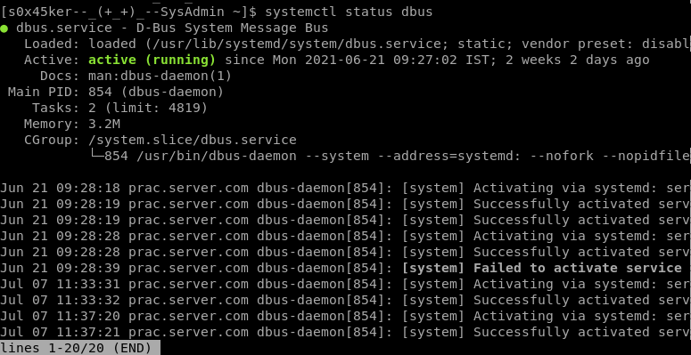

### What is `systemd`?
 `systemd` consists of these components:

-   `systemd`, which is the system and service manager
-   `systemctl`, a command line tool to interact with `systemd`
-   `journald`, a unified logging framework
-   `logind`, a daemon that handles user logins and seats
-   `resolved`, `timesyncd`, and `networkd`, which are responsible for network connection, domain name resolution and synchronizing time with internet resources

### Managing existing services

A service is essentially a process, running in the background and managed/provisioned by `systemd`. Stuff you would like to run as services includes various servers (HTTP, SSH, FTP), synchronization utilities (Syncthing, `rsync`), virtualisation hypervisors (Docker, K8s), and many more. Let’s start by **listing all available services** on your system by running this command:

```bash
[s0x45ker--_(+_+)_--SysAdmin ~]$ systemctl
```


Here is the structure of this table:

-   Name of the service. (Matches the name of the `.service` config file)
-   Current status of the service. `loaded` means `systemd` knows about it, `active` means `systemd` ran it successfully
-   Current status of the process. It indicates if the process is `running` or `exited`. Note that an `active` service can be `exited` (for example, 1 action has to happen at boot, and the process than returns. The service is still considered `active`.
-   Description

If you want to see some **more details of a specific service**, use this command:
```bash
[s0x45ker--_(+_+)_--SysAdmin ~]$ systemctl status dbus
```



To **start/stop services**, use this:

```
systemctl start/stop <Service_Name>
```

Similarly, you can **enable or disable the services**. Enabled means it will run on boot:

```
systemctl enable/disable <SERVICE_NAME>
```

### Creating your own services

I have created a script in /home/void/rabbit.py
```python
#!/usr/bin/env python3
from time import sleep

import socket

HOST = '0.0.0.0'  # Standard loopback interface address (localhost)
PORT = 1234        # Port to listen on (non-privileged ports are > 1023)

message = 'Wake up, s0x45ker...\nThe Matrix has you...\nFollow the White Rabbit.\nKnock, Knock, s0x45ker.'

#for char in message:
#    print(char)

with socket.socket(socket.AF_INET, socket.SOCK_STREAM) as s:
        s.bind((HOST, PORT))
        s.listen()
        conn, addr = s.accept()
        with conn:
            print('Connected by', addr)

            for char in message:
                conn.send(bytes(char, 'utf-8'))
                sleep(0.3)


```

I created a service in cat /etc/systemd/system/rabbit.service

```bash
[Unit]
Description=Rabbit Service
After=network.target

[Service]
type=Simple
User=void
Restart=always
ExecStart=/usr/bin/env python3 /home/void/rabbit.py

[Install]
WantedBy=multi-user.target

```

this script simply creates a tcp service for everyone in the network
and I use Netcat to connect to the service


